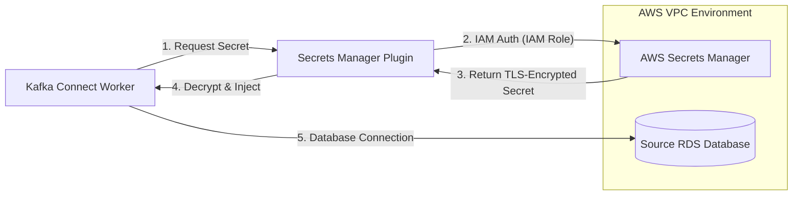

# Enterprise MSK Migration & Infrastructure Management

## Role: Lead Migration Architect
As the Lead Architect for the organization-wide transition from legacy Kafka to **Amazon MSK**, I spearheaded the end-to-end migration of all data streams, connectors, and topics. This suite contains the production-hardened configurations and automation logic used to secure and optimize our enterprise ingestion layer.

---
### 1. Stakeholder Coordination
I led weekly syncs with three multiple teams to define the migration roadmap:
- **Application Teams**: Managed the end-to-end synchronization of data consumption logic with the new MSK single-partition FIFO topic architecture.
- **Database Team**: Audited source views to ensure indices were optimized for timestamp-based ingestion.
- **Airflow (App) Team**: Coordinated offset resets to ensure continuous data processing during the topic cutovers.
- **DevOps/Infrastructure**: Defined the IAM Roles and cross-account access policies for Secrets Manager.
  
## 2. Security Layer: AWS Secrets Manager Integration

### Overview
In our legacy Kafka environment, database credentials (usernames/passwords) were hardcoded in plaintext within configuration files. I engineered a "Zero-Trust" security model by implementing the `SecretsManagerConfigProvider` to dynamically fetch credentials at runtime using MSK IAM Role-based authentication.

### Architectural Logic


### Technical Implementation
- **Plugin Placement**: Installed `aws-msk-config-provider.jar` in the specialized custom plugin path.
- **Worker Configuration**:
  ```properties
  config.providers=secretsManager
  config.providers.secretsManager.class=com.amazonaws.kafka.config.providers.SecretsManagerConfigProvider
  config.providers.secretsManager.param.region=ap-south-1
  ```
- **Usage Syntax**: `${secretsManager:secret_path:key}`

---

## 3. Orchestration Layer: Staggered "Pulse" Ingestion

### Overview
To mitigate the risk of connection surges on the source database (RDS Read Replica), I engineered a "Staggered Ingestion" model. Instead of standard continuous polling, the connectors operate in a coordinated "burst" mode managed by a custom Bash controller and Linux `cron`.

### Logic Timeline

```mermaid
gantt
    title Staggered Ingest Timeline (2:00 PM IST)
    dateFormat  HH:mm
    axisFormat  %H:%M
    
    section Orchestration Script
    Start Orchestration       :active, 14:00, 14:45
    
    section Connectors Pulse
    Connector 1 (Campaigns)   :crit, 14:00, 14:10
    Gap (sleep 300s)          :done, 14:00, 14:05
    Connector 2 (YLMA)        :crit, 14:05, 14:15
    Gap (sleep 300s)          :done, 14:05, 14:10
    Connector 3 (Donations)   :crit, 14:10, 14:20
    Gap (sleep 300s)          :done, 14:10, 14:15
```


### Operational Logic
1. **Quiescent State**: Connectors are locked with a `poll.interval.ms` of 12 hours.
2. **Scheduled Trigger**: System Cron initiates the `stagger_pulse.sh` script twice daily. [stagger_pulse.sh](https://github.com/KrishnaaCloud/Kafka/blob/c17086a37c8ed1b00fe06de515e4a2b1c79cfa50/msk%20/Scripts%20/stagger_pulse.sh)
3. **Automated Restart**: The script forces a `POST /restart` for each task with a **300-second sleep** between activations to spread database load evenly.

---

## 4. Data Integrity: Strict FIFO Implementation

To resolve data ordering issues for downstream consumers (Airflow DAGs), I successfully managed the migration of multi-partition topics to a **Single-Partition Model**.

- **Topic Normalization**: Migrated legacy 10-partition topics to **`partitions=1`** for strict global ordering.
- **SQL Optimization**: Audited and redesigned legacy SQL queries to utilize subquery patterns, preventing syntax conflicts while ensuring **`ereceipt_date ASC`** chronological ingestion.

---

## Repository Directory Structure
- `/connectors`: Hardened JSON configurations for MSK JDBC Source Connectors.
- `/scripts`: Custom Bash orchestration suite for staggered execution.
- `/docs`: Technical deep-dives and migration strategy documents.

